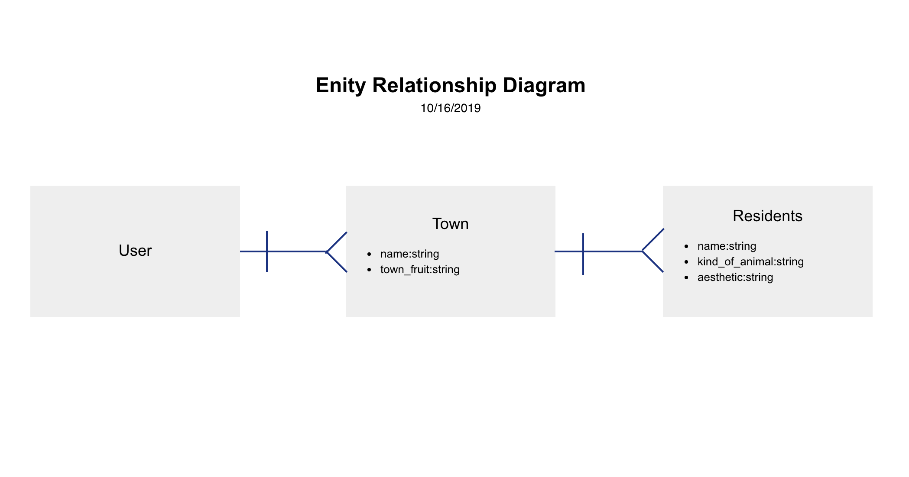
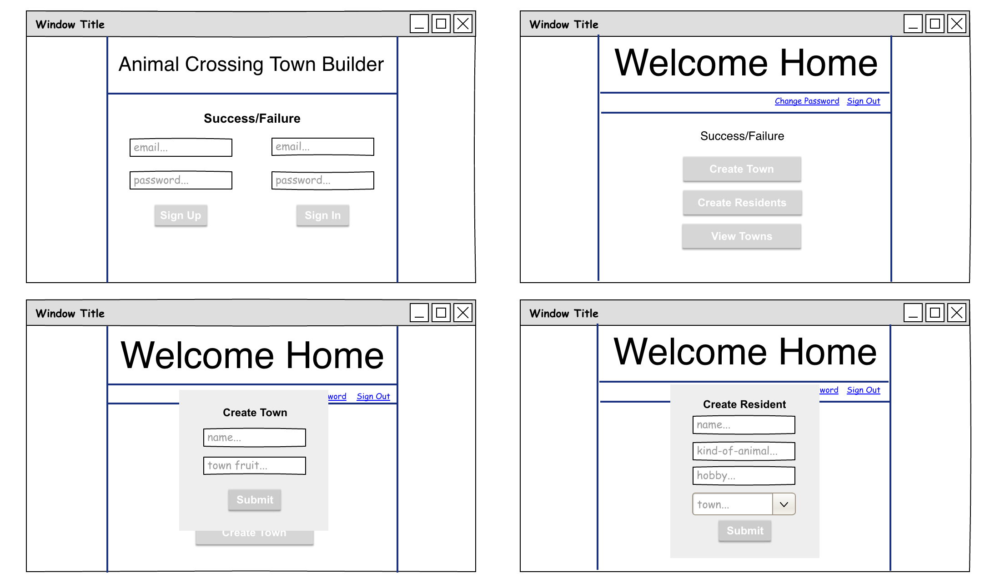
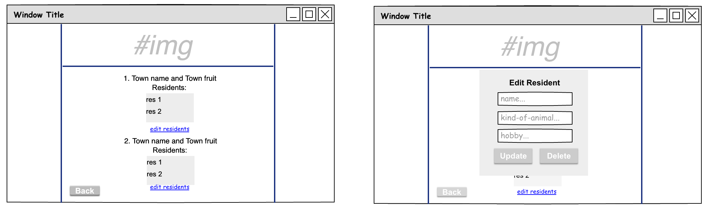

# Animal Crossing Town Builder: Description

My Animal Crossing Town Builder is a single page application that utilized an API. The user can sign up and sign in with a unique email and password, and build a town with their own unique attributes! This application was inspired by Nindendo's Animal Crossing franchise. Newly created towns are stored within the database and the user can retrieve, edit, and remove any of the data under their account. This application was build within 4 business days (with a weekend to break it up).

# Link to live game!

- [Animal Crossing Town Builder](https://sangelici.github.io/AC-Town-Builder-Client/)
- [Animal Crossing Town Builder: Heroku API](https://salty-scrubland-96340.herokuapp.com/)

# Link to Front-End repository

[Animal Crossing Town Builder: REPO](https://github.com/sangelici/AC-Town-Builder-Client)

# Story

I have to say, I was extremely excited to jump into this project. I thoroughly enjoyed the couple of weeks studying Ruby and Ruby on Rails, and this project was all about putting that knowledge into use. As stated above, I was inspired by the video game, Animal Crossing, and I wanted to implement it's rules into my application to stay true to the game.
My original plan was to create two one-to-many resource relationships (towns and residents) and connect them to the user. That way, anyone who signs in can create their own unique towns and add residents to them!
With all the new and fresh information regarding Ruby and API's, I set off and built the API in the first day. The main relationship was between the User and the Town resources, and the intention was to create a 'User has_many :residents, through: :towns' relationship to connect the second table, but when the next day came, so did the challenges. Connecting the API to the front end was difficult. It required a much slower pace and many debugging practices to make the proper requests run.
Through much trial and error, as well as with discussions and help from my classmates, I was able to put together this wholesome application.
This project for me was not as difficult as the first one (Tic-Tac-Toe), and with more tools under my belt, I challeneged myself to think big and do my best to meet my goals. While I have not yet put in the front-end functionality for my residents resource, I continue to be excited to work more and make this a more versitile application. I also greatly enjoyed exploring all of my possibilities when it came to design through CSS and Bootstraps.

# User Stories

  Auth:
  1. As the user, I want to be able to sign up with a unique email and password
  2. As the user, I want to be able to sign in with my email and password
  3. As the user, I want to be able to change my password
  4. As the user, I want to be able to sign out when I’m done

  API:
  1. As the user, I want to be able to create a town and add residents
  2. As the user, I want to be able to select a resident and update the information within
  3. As the user, I want to be able to select and delete resident
  4. As the user, I want to press a button and view the towns and residents that I have created

Note: I did not reach the point of implementing the front-end functionality for my Residents resource, but it will be something I would like to incorporate in the future! All CRUD actions have been applied to the towns resources

# Technologies Used

  - HTML
  - CSS
  - Sass
  - Bootstraps
  - Handlebars
  - JavaScript
  - jQuery
  - Ajax
  - Curl/API
  - RESTful API
  - Ruby
  - Ruby on Rail

# Future Goals
  - Add variables to the index.scss file to refactor
  - Add in front-end functionality for the Resident resource table
      - Full CRUD functionality
      - To stay true to the game, remove PATCH from Towns resource
  - Add in the 'open cirle' animation when transitioning to a new view (think Loony Toons 'Fin' animation)
  - Remove overflow from corners of browser where the background extends passed the border
  - Incorporate a real time clock that adjusts to user location
  - Incorporate a weather api and adjust 2nd view background to real time weather (staying true to the game, also a big stretch goal!)

# ERD + Wireframe:

